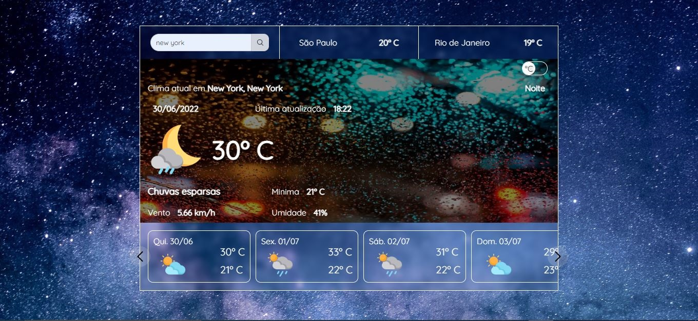
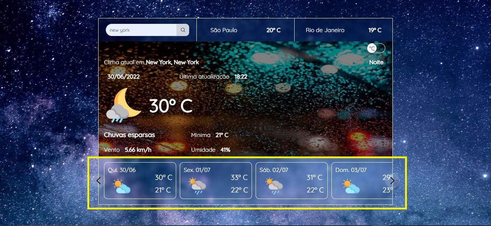
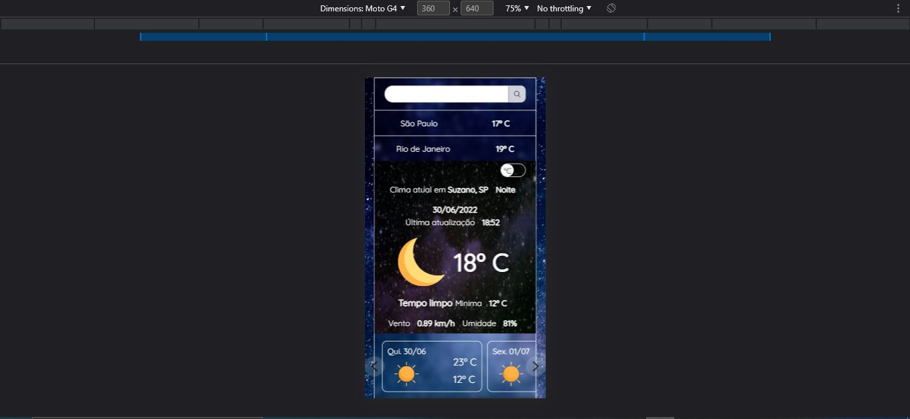
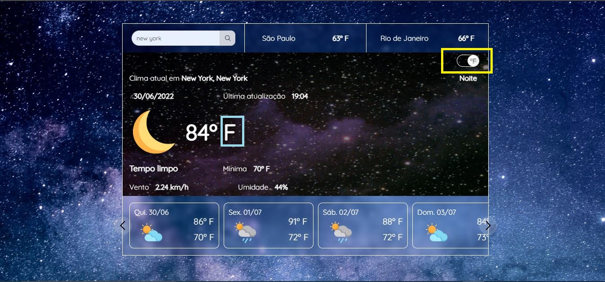

# Previsão do tempo #

## Descrição ##
---
 

A aplicação consome uma API de dados metereológicos dos servidores da [hgbrasil](hgbrasil.com). Retornando as informações da cidade de São Paulo, Rio de Janeiro e Belo Horizonte. Permitindo fazer pesquisas de cidades do mundo inteiro.

 

### A aplicação também exibe a previsão para os próximos 9 dias. ###
 

 
 
 

### Adaptada para dispositivos móveis ###
 

 
 
 

### Tem a possibilidade de converter a unidade de temperatura de *Celsius* para *Fahrenheit* e vice versa. ###
 

 

---

 

## Tecnologias usadas ##
 

* HTML
* CSS
* JAVA SCRIPT - fetch API

 

## Links ##
 

* Pagina Web: https://previsao-do-tempo-a.netlify.app/
* API HG Brasil: https://hgbrasil.com/
